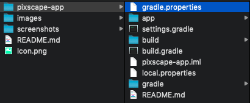

# ScapeKit Pixscape for Android (using ScapeKit-core 1.0.7)

Your phone's GPS is not accurate enough. When used in a middle of skyscrapers and tall buildings, GPS can be extremely inaccurate.

Pixscape allows you to get an accurate and high precision position by scanning your surroundings using your device's camera.

## Running the App

* Clone the repository
* Add `gradle.properties` file at the same level as your `build.gradle` project file 

</a>

* Then copy and paste:
```
ScapeKitApiKey=
GoogleMapsApiKey=
```

* Fill in the property value with your actual `API_KEY` created on your developer dashboard
  If you do not have one yet, request Alpha Access to the SDK [here](https://scape.io). This will enable you to generate an **API Key** that you can embed later on into your own Android application.

* Likewise, fill in `GOOGLE_MAPS_API_KEY` with your own Google Maps Api key.

* Now you can deploy the application on your device.

* Localize your current surroundings, and visually check the Scape POI position on the Maps. If it points to your current location, then we have a match!


## Scape areas coverage

 Go to the developer portal [accounts page](https://developer.scape.io/dashboard) to see what areas are currently live.