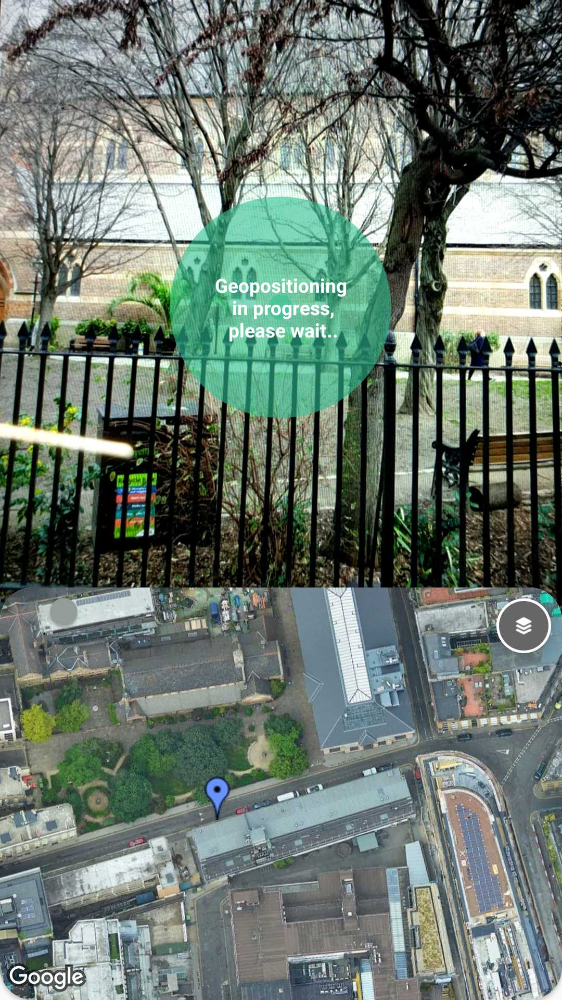
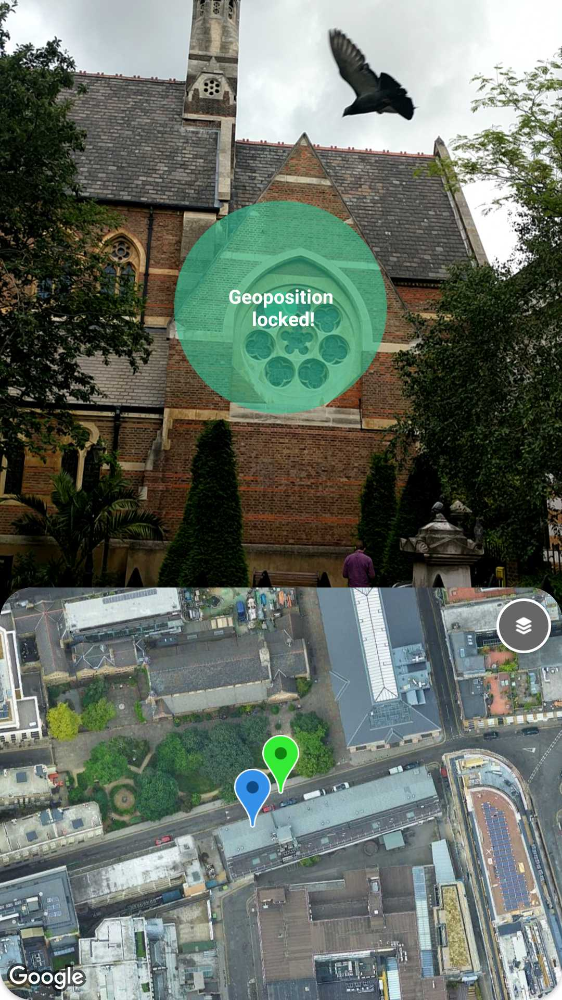
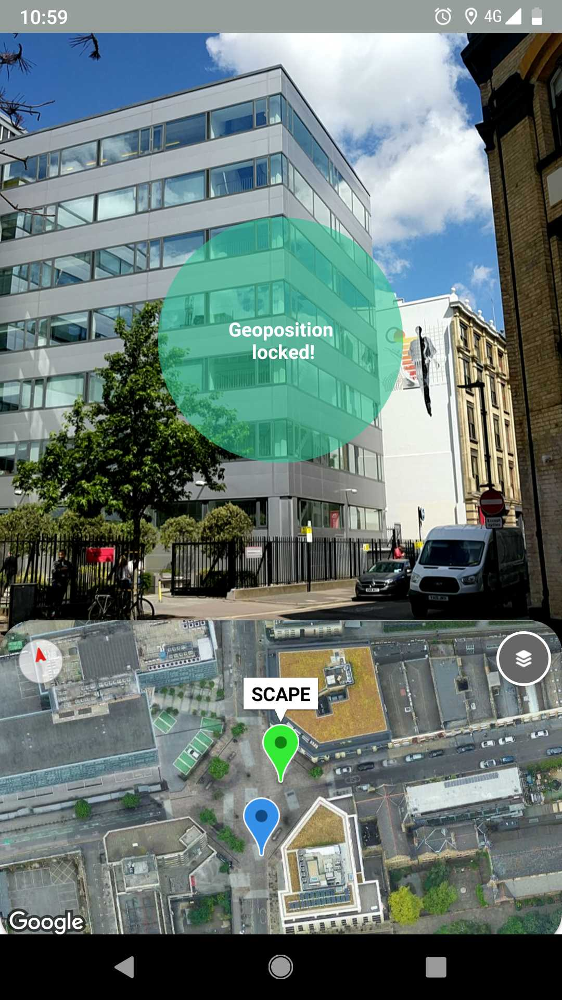

# Pixscape - Android

This tutorial shows how to use ScapeKit SDK and Google Maps into an application that displays a Marker for current location, requested on demand by the user, written in Kotlin.

**Audience**. 
This tutorial is designed for people familiar with Android development and object-oriented programming concepts. You should also be familiar with Google Maps from a user's point of view.

This conceptual documentation is designed to let you quickly start exploring and developing applications with the ScapeKit SDK for Android. 

## Get the code/ Getting started

Clone or download the ScapeKit [Pixscape Sample repository](https://github.com/scapetechnologies/pixscape-android) from Github.
In Android Studio, use the "Import Project" option.

Next steps will explain from how this project was created, how to enable Scapekit and Google Maps in order to display Markers after each localization.

## ScapeKit Installation

### Obtain a ScapeKit API key

Request Alpha Access to the SDK [here](https://scape.io). This will enable you to generate an **API Key** that you can embed later on into your own Android application.

### Download

ScapeKit Android is distributed in an **.aar** format. 
To use it in your project add ScapeKit's maven repository to your top-level `build.gradle` file:

```groovy
    buildscript {
        ext.kotlin_version = '1.3.0'
        repositories {
            google()
            jcenter()
            maven { url "https://artefacts.developer.scape.io/android/" }
        }
        dependencies {
            classpath 'com.android.tools.build:gradle:3.2.1'
            classpath "org.jetbrains.kotlin:kotlin-gradle-plugin:$kotlin_version"
        }
    }

    allprojects {
        repositories {
            google()
            jcenter()
            maven { url "https://artefacts.developer.scape.io/android/" }
        }
    }
```

To use ScapeKit in your project add its dependency to your application build file:

```groovy
    dependencies {
        implementation 'com.scape:scapekit:x.x.x@aar' // specify the desired version here
    }
```

(We strongly advise against using dynamic dependencies in your applications as it can introduce unexpected behaviors and they add nondeterminism to your build.)

## Integrate Google Maps

Version [v3.0.0 beta of the Google Maps SDK](https://developers.google.com/maps/documentation/android-sdk/v3-client-migration) is used in this sample, that is a new implementation with same API surface as the previous version, but that is distributed as a standalone static library, that is not as part of Google Play services anymore.

### Create a Google Maps project

This project was created with *Google Maps Activity* in the 'Add an activity dialog' in order to include a map activity.


With this step Android Studio generates: *google_maps_api.xml* resource, *activity_maps.xml* layout  and the *MainActivity.kt* files. 


### Install the Maps SDK for Android client library

Download [maps-sdk-3.0.0-beta.aar](https://dl.google.com/dl/geosdk/maps-sdk-3.0.0-beta.aar)

Copy the AAR file into the _app/libs_ folder of your Android Studio project.
In the top-level *build.gradle* file add a _flatDir_ section:

```groovy
allprojects {
  repositories {
      google()
      jcenter()
      flatDir {
          dirs 'libs'
      }
  }
}
```

Add the required dependencies to your app-level *build.gradle* file:

```groovy
dependencies {
	// Maps SDK
    implementation name: 'maps-sdk-3.0.0-beta', ext: 'aar'
    implementation 'com.google.android.gms:play-services-basement:15.0.1'
    implementation 'com.google.android.gms:play-services-base:15.0.1'
    implementation 'com.google.android.gms:play-services-gcm:15.0.1'
    implementation 'com.google.android.gms:play-services-location:15.0.1'
}
```

Because we are going to use the new standalone Map library, we can do not need the implementation line for the previous version:
```groovy
dependencies
  implementation 'com.google.android.gms:play-services-maps:16.1.0'
}
```

Sync your Gradle project.

### Understand the map code

*activity_maps.xml* layout defines a *SupportMapFragment* that acts as a container for the map:

```xml
<fragment xmlns:android="http://schemas.android.com/apk/res/android"
    xmlns:tools="http://schemas.android.com/tools"
    android:id="@+id/map"
    android:name="com.google.android.gms.maps.SupportMapFragment"
    android:layout_width="match_parent"
    android:layout_height="match_parent"
    tools:context=".MainActivity" />
```

In your activity's `onCreate()` method, the layout file is already set as the content view.  
Then we use *getMapAsync()* to register for the map callback:

```kotlin
    override fun onCreate(savedInstanceState: Bundle?) {
        super.onCreate(savedInstanceState)
        setContentView(R.layout.activity_maps)
        // Obtain the SupportMapFragment and get notified when the map is ready to be used.
        val mapFragment = supportFragmentManager
            .findFragmentById(R.id.map) as SupportMapFragment
        mapFragment.getMapAsync(this)
    }
```

The only thing left is to implement the *OnMapReadyCallback*, to set up our map object whenever the GoogleMap object is available:

```kotlin
class MapsActivity: AppCompatActivity(), OnMapReadyCallback {
	private lateinit var map: GoogleMap

	override fun onMapReady(googleMap: GoogleMap) {
		map = googleMap
	}
}
```

Notice that the *google_maps_api.xml* file contains instructions on how to get your Google Maps API key and how to embed it in your application. 

### Get a Google Maps API Key
 
 Fastest way is to follow the link provided in your *google_maps_api.xml* that takes you to Google Cloud Platform console where you can create an Android-restricted API key for your project.
 Copy-paste the resulting API Key into the <string> element in the *google_maps_api.xml* file.
 
 Complete steps are explained in detail [here](https://developers.google.com/maps/documentation/android-sdk/start#step_4_get_a_google_maps_api_key)

*Understand the code*
## Display Scape location on Map

Localization time!
Now that we the map set up we are ready to add Markers when we get Scape measurements.

### Integrate ScapeKit SDK for Android

**■ Specify API key**

The _ScapeClient_ instance needs an API key generated at the previous step.
We will also enable _debugSupport_ flag, for logging purposes.
    
```kotlin
    class MyApp: Application() {

    lateinit var scapeClient: ScapeClient

    override fun onCreate() {
        super.onCreate()

        scapeClient = Scape.scapeClientBuilder
                            .withContext(applicationContext)
                            .withApiKey("Put your Api Key here")
                            .build()
       }
   }
```

**■ Now start the _ScapeClient_ instance**

```kotlin
    class MyApp: Application() {

        scapeClient.start(clientStarted = {
            Log.i(TAG, "ScapeClient started")
        }, clientFailed = {
            Log.i(TAG, it)
        })
       }
    }
```

The layout for *MainActivity.kt* is a basic view split between the AR view and the map with a localization button:
```kotlin
localize_button.setOnClickListener{
    scapeSession!!.getMeasurements(this)
}
```

The *MainActivity.kt* then registers for *ScapeSessionObserver* callbacks:
```kotlin
class MainActivity : AppCompatActivity(), OnMapReadyCallback, ScapeClientObserver, ScapeSessionObserver{
	...
	override fun onDeviceMotionMeasurementsUpdated(scapeSession: ScapeSession?, measurements: MotionMeasurements?) {
        Log.d(TAG, "onDeviceMotionMeasurementsUpdated $measurements")
    }

	override fun onScapeMeasurementsUpdated(scapeSession: ScapeSession?, measurements: ScapeMeasurements?) {
	}

	override fun onDeviceLocationMeasurementsUpdated(scapeSession: ScapeSession?, measurements: LocationMeasurements?) {
	}
}
```

For the ease of implementation, whenever there is a new ScapeMeasurement available we will add a green Marker and zoom in the map to that geo position:

```kotlin

    fun addMarkerAndMoveMapToGeoPosition(measurements: ScapeLatLng?, measurementsType: GeoSourceType) {
    	measurements?.let {
            val currentLatLng = LatLng(measurements.latitude, measurements.longitude)

            previousMarker = mMap.addMarker(MarkerOptions()
                     .position(currentLatLng)
                     .icon(BitmapDescriptorFactory.fromResource(R.drawable.green_dot))
                     .title("VPS")))

            mMap.moveCamera(CameraUpdateFactory.newLatLng(currentLatLng))
            mMap.animateCamera(CameraUpdateFactory.newCameraPosition(CameraPosition.Builder().target(currentLatLng).zoom(ZOOM_IN_LEVEL).build()))
        }
    }

    override fun onDeviceLocationMeasurementsUpdated(p0: ScapeSession?, measurements: LocationMeasurements?) {
        Log.d(TAG, "onDeviceLocationMeasurementsUpdated $measurements")

        runOnUiThread{
            addMarkerAndMoveMapToGeoPosition(measurements?.latLng, GeoSourceType.RAWSENSORS)
        }
    }
```

Now for each user click on the Localize button the map will be populated with a new marker, so let's keep track of markers so we can always remove the previous ones.

```kotlin
override fun onScapeMeasurementsUpdated(scapeSession: ScapeSession?, measurements: ScapeMeasurements?) {
    Log.d(TAG, "onDeviceLocationMeasurementsUpdated $measurements")
       
    runOnUiThread{
    	previousMarker?.let {
        	previousMarker.remove()
    	}

        addMarkerAndMoveMapToGeoPosition(measurements?.latLng, GeoSourceType.RAWSENSORS)
    }
}    
```


**Note**  
The following sections were designed/written to ensure a smooth UX experience, so that when the application is exposed to configuration and network changes, the end user will go through a seamless experience.

## Handle connectivity

For better user experience our app needs to notify the end user if the handset id not connected to the t, or the connection is too slow to complete the requests.

As described in the [Android official docs](https://developer.android.com/training/monitoring-device-state/connectivity-monitoring) we will create our own *BroadcastReceiver* that will notify the UI whenever the connectivity is lost.

```kotlin
class NetworkChangeReceiver : BroadcastReceiver() {

    override fun onReceive(context: Context?, intent: Intent?) {
        val status: Boolean = NetworkUtil.isConnected(context!!)

        if (!status){
            showOfflineDialogActivity(context)


        }
    }
```

And register/un the receiver when application goes to foreground/background:

```kotlin

fun registerConnectivityReceiver() {
    val netFilter = IntentFilter()
    netFilter.addAction("android.net.conn.CONNECTIVITY_CHANGE")

    this.registerReceiver(connectivityReceiver, netFilter)
}

override fun onResume() {
	super.onResume()

	...
	registerConnectivityReceiver()
}
```

Note that since Android Oreo, implicit broadcast receivers won’t work when registered in the AndroidManifest.xml

## Handle permissions

 ScapeKit contains *PermissionHelper* utility that determines if the required permissions are Granted [PermissionHelper.checkPermissions] and allows developer to request for the missing permissions at runtime [PermissionHelper.requestPermissions]

Check if permissions required by ScapeKit have been granted and prompt the user to grant the ones that haven't been granted yet.

 ```kotlin
    private fun checkAndRequestPermissions() {
        val deniedPermissions = PermissionHelper.checkPermissions(this)

        if (deniedPermissions.isEmpty()) {
            initScapeClient()
        }
        else {
            PermissionHelper.requestPermissions(this, deniedPermissions)
        }
    }
 ```

Only attempt to init ScapeClient once all the required permissions are Granted
```kotlin
    override fun onRequestPermissionsResult(requestCode: Int, permissions: Array<out String>, grantResults: IntArray) {
        super.onRequestPermissionsResult(requestCode, permissions, grantResults)

        if (PermissionHelper.checkPermissions(this).isEmpty()) {
            initScapeClient()
        }

        PermissionHelper.processResult(this, requestCode, permissions, grantResults)
    }
```

## Application lifecycle

One last thing to take care of/into consideration is to pause any heavy/outgoing requests while the application goes to background.

When activity is in background we pause the current ARSession:
```kotlin
    override fun onPause() {
        super.onPause()

        scapeClient.stop({}, {})

        (sceneform_fragment as? ArFragment)?.arSceneView?.session?.pause()
    }
```

Terminate the _ScapeClient:
When the app is in background, _ScapeClient_ should be stopped. If the client is currently listening for incoming events, it needs to stop listening as well. After `terminate` is called, any object retrieved directly from ScapeClient ( `ScapeSession`) is considered invalid. 

```kotlin
    override fun onDestroy() {
        unregisterConnectivityReceiver()

        scapeClient.terminate({}, {})

        super.onDestroy()
    }
``` 

## Run it!

Build and run your app.
In Android Studio, click the *Run* menu option to run your app.






